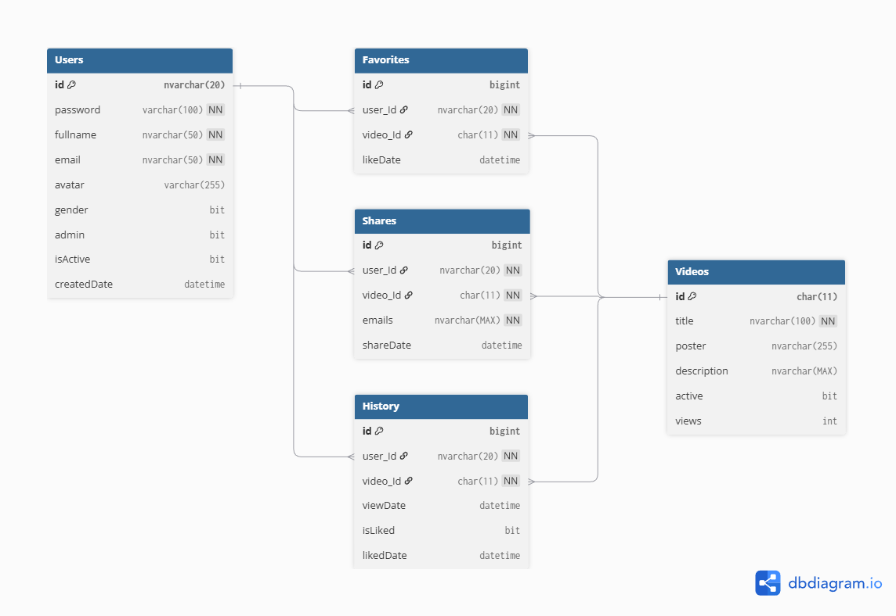
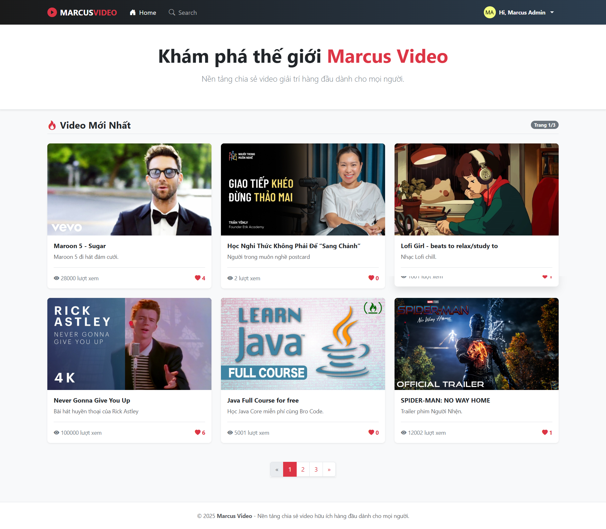
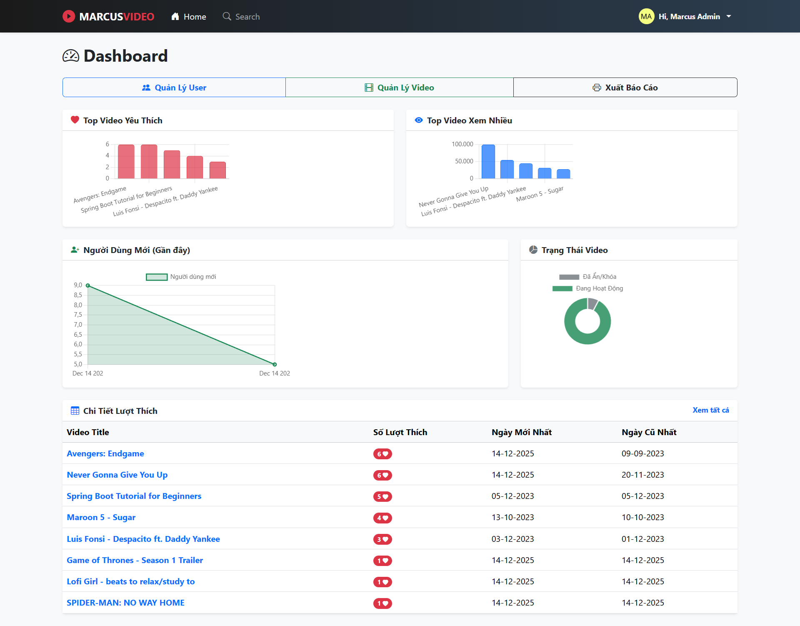
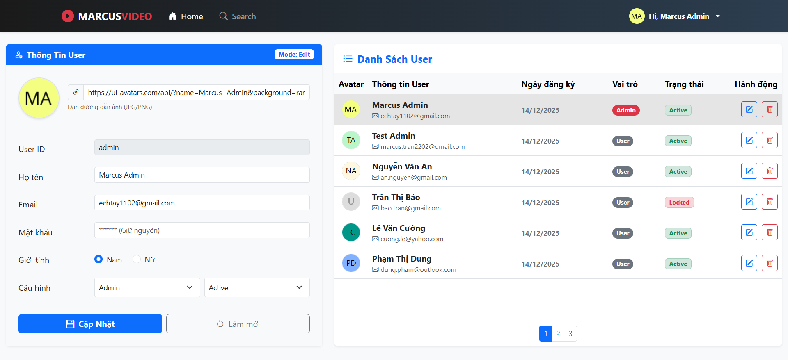
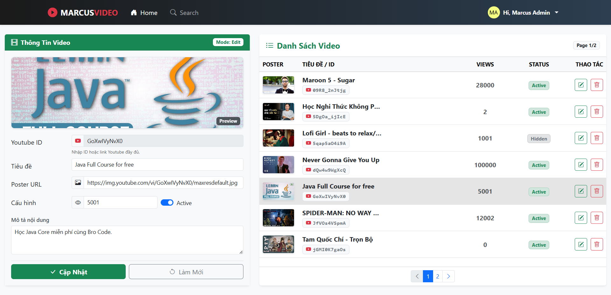

# 🎬 MarcusVideo - Mini-project Java Servlet

> **Nền tảng xem, chia sẻ Video trực tuyến hiệu năng cao, tích hợp tương tác thời gian thực.**

   

## 📖 Tổng quan
**MarcusVideo** là dự án nhỏ nghiên cứu chuyên về cơ chế **Low-level Web Server** sử dụng **Java Servlet/JSP thuần** (No Framework). Dự án tập trung giải quyết các bài toán cốt lõi:
* **Performance:** Tối ưu Database, Caching, xử lý N+1 Problem.
* **Security:** Tự xây dựng cơ chế Authentication/Authorization (RBAC).
* **User Experience:** Ứng dụng AJAX (Fetch API) cho trải nghiệm SPA (Single Page App).

## 🚀 Điểm nhấn Kỹ thuật (Key Highlights)

| Hạng mục | Công nghệ & Giải pháp |
| :--- | :--- |
| **Kiến trúc** | Layered Architecture (MVC), Singleton Pattern, Dependency Injection thủ công. |
| **Database** | SQL Server 2019, Server-side Pagination, Native Query, Hibernate Lazy Loading. |
| **Bảo mật** | **Servlet Filter** (Phân quyền), **BCrypt** (Mã hóa mật khẩu), UUID File Handling. |
| **Frontend** | **Fetch API** (Xử lý Like/Share bất đồng bộ), **Chart.js** (Dashboard thống kê). |
| **Hệ thống** | **Log4j2** (Audit Log & System Log), **Email Async Service** (Gửi mail đa luồng). |

## 🛠️ Tech Stack
* **Backend:** Java 21, Servlet/JSP, Hibernate 6.4, Log4j2.
* **Database:** SQL Server 2019.
* **Frontend:** Bootstrap 5, JavaScript (ES6).
* **Tools:** Maven, Git, Eclipse/IntelliJ.

## 🗂️ Database Design
Hệ thống gồm 5 bảng chính, chuẩn hóa 3NF.
*(Xem sơ đồ chi tiết bên dưới hoặc file script: [docs/marcus-video.sql](./docs/marcus-video.sql))*

## 📸 Screenshots
> 
> 
> 
> 
## ⚙️ Cài đặt nhanh
1. **Clone Repo:** `git clone https://github.com/MarcusTr98/Marcus-video.git`
2. **Database:** Chạy script `docs/marcus-video.sql` trong SQL Server.
3. **Config:**
    * Update DB User/Pass trong `src/main/resources/META-INF/persistence.xml`.
    * Update Email App Password trong `src/main/java/utils/EmailUtils.java`.
4. **Run:** Chạy trên Tomcat 10+ (Server port 8080).

## 🤝 Liên hệ
* **Dev:** Marcus Tran
* **Email:** marcus.tran2202@gmail.com
